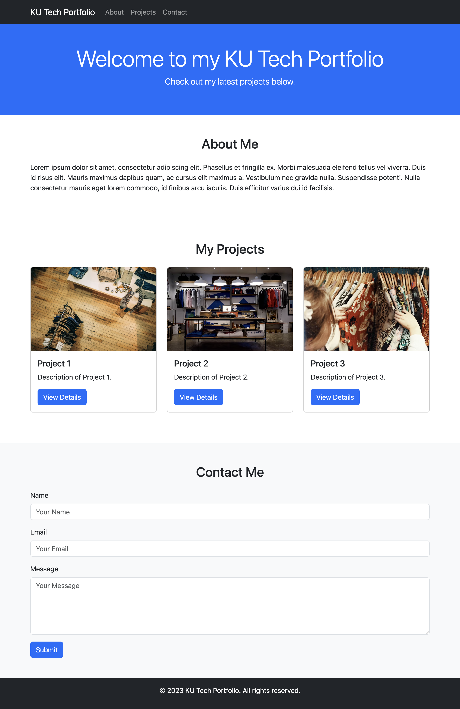

# Portfolio Sample

> ### โครงสร้าง HTML (1 ชั่วโมง)
>
> -   โครงสร้าง HTML พื้นฐาน: (15 นาที)
> -   เพิ่มลิงก์ CSS ของ Bootstrap: (10 นาที)
> -   สร้าง navbar และปุ่ม responsive: (20 นาที)
> -   ทำ smooth scrolling ในปุ่ม menu: (15 นาที)

> ### ส่วน Hero Section และ About Me (1 ชั่วโมง)
>
> -   สร้างส่วน Hero Section: (20 นาที)
> -   เพิ่ม Container ใน Hero Section และกำหนดรูปแบบอักษร: (10 นาที)
> -   สร้างส่วน About Me และเพิ่มเนื้อหา: (20 นาที)
> -   ใส่ Style ใน About Me (10 นาที)

> ### ส่วนโครงการและแบบฟอร์มติดต่อ (1 ชั่วโมง)
>
> -   สร้างส่วนโครงการและตั้งค่าเค้าโครงการแบบกริด: (10 นาที)
> -   เพิ่ม Card และใส่รายละเอียดแต่ละ Card: (20 นาที)
> -   สร้าง Contact Me และเพิ่มแบบฟอร์ม: (20 นาที)
> -   ทำส่วน footer: (10 นาที)

<!-- to table -->

| หัวข้อ                                              | เวลาที่ใช้ |
| --------------------------------------------------- | ---------- |
| > **_โครงสร้าง HTML (1 ชั่วโมง)_**                  |            |
| โครงสร้าง HTML พื้นฐาน                              | 15 นาที    |
| เพิ่มลิงก์ CSS ของ Bootstrap                        | 10 นาที    |
| สร้าง navbar และปุ่ม responsive                     | 20 นาที    |
| ทำ smooth scrolling ในปุ่ม menu                     | 15 นาที    |
| > **_ส่วน Hero Section และ About Me (1 ชั่วโมง)_**  |            |
| สร้างส่วน Hero Section                              | 20 นาที    |
| เพิ่ม Container ใน Hero Section และกำหนดรูปแบบอักษร | 10 นาที    |
| สร้างส่วน About Me และเพิ่มเนื้อหา                  | 20 นาที    |
| ใส่ Style ใน About Me                               | 10 นาที    |
| > **_ส่วนโครงการและแบบฟอร์มติดต่อ (1 ชั่วโมง)_**    |            |
| สร้างส่วนโครงการและตั้งค่าเค้าโครงการแบบกริด        | 10 นาที    |
| เพิ่ม Card และใส่รายละเอียดแต่ละ Card               | 20 นาที    |
| สร้าง Contact Me และเพิ่มแบบฟอร์ม                   | 20 นาที    |
| ทำส่วน footer                                       | 10 นาที    |

